# Laporan Asesmen - Pemrograman III (Webservice)
**Semester Ganjil/Genap T.A. 2025-2026**

**Nama:** Muhamad Rifaidi  
**NPM:** 714240044  
**Program Studi:** D4 Teknik Informatika – Sekolah Vokasi  

---

## 1. Tema Proyek
Tema proyek yang dipilih adalah **Sistem Manajemen Inventaris Kantor (InvenTrack)**. Sistem ini dirancang untuk mendata barang-barang inventaris perusahaan serta mencatat alur peminjaman barang antar departemen. Terdapat dua entitas tabel utama dalam sistem ini:
- `barang`: Menyimpan data detail inventaris seperti nama barang, kategori, jumlah, harga satuan, dan status.
- `peminjaman`: Mencatat riwayat peminjaman barang oleh pegawai/departemen, lengkap dengan tanggal pinjam dan tanggal pengembalian.

## 2. Alur Proses (Frontend Request hingga Backend Response)
Sistem ini menggunakan arsitektur *Client-Server* terpisah antara Frontend (React/Vite) dan Backend (Golang/Fiber). Berikut adalah penjelasan alur proses ketika pengguna berinteraksi dengan aplikasi (contoh kasus: Mengambil Data Barang - `GET All Data`):

1. **Frontend Request (Client-Side):**
   - Pengguna membuka halaman "Data Barang" di antarmuka website (React).
   - Komponen React (`DataBarangPage.jsx`) akan ter-render dan memicu *lifecycle hook* `useEffect`.
   - Di dalam `useEffect`, fungsi *fetch data* dipanggil, yang mana menggunakan library `Axios` (`barangApi.js`) untuk mengirimkan HTTP `GET` request ke endpoint backend: `http://localhost:3000/api/barang`.

2. **Backend Processing (Server-Side):**
   - Aplikasi backend (Golang dengan *framework* Fiber) menerima request tersebut pada port `3000`.
   - Request pertama kali akan melewati lapisan **Middleware**. Middleware `Logger` mencatat aktivitas request ini ke console terminal, sedangkan Middleware `CORS` memastikan bahwa request dari origin `localhost:5173` (Frontend) diizinkan untuk mengakses resource API.
   - Setelah lolos middleware, router API akan mengarahkan request ke *Handler* fungsi `GetAllBarang` di dalam `barang_handler.go`.
   - Handler akan berinteraksi dengan modul **Config/Database**. Menggunakan ORM (GORM), aplikasi mengeksekusi query ke database utama **PostgreSQL Supabase** untuk mengambil seluruh baris data dari tabel `barang`.
   - Database Supabase mengembalikan data yang diminta ke aplikasi Golang.

3. **Backend Response:**
   - Setelah data berhasil diambil, *Handler* akan membungkus data tersebut ke dalam struktur JSON yang konsisten menggunakan *struct* `models.Response`.
   - Backend mengirimkan balasan (Response) kembali ke Frontend dengan HTTP Status Code `200 OK` dan tipe konten `application/json`.

4. **Frontend Rendering:**
   - `Axios` di Frontend menerima response JSON tersebut.
   - Data barang kemudian diekstrak dan disimpan ke dalam *state* React (`setData(res.data.data)`).
   - Perubahan *state* memicu *re-render* pada UI, dan akhirnya data barang ditampilkan dengan rapi dalam bentuk komponen Ant Design `Table` (Atomic Design).

## 3. URL Repository GitHub
Berikut adalah tautan repositori *source code* untuk proyek ini:
- **Repository Backend dan Frontend:** (https://github.com/MuhRifa2024/PemrogramanIII_714240044.git)

---

## 4. Screenshot Database PostgreSQL Supabase
*(Berikut adalah bukti pembuatan tabel dan isi data di Supabase).*

**SCREENSHOT: TABEL BARANG:**
> 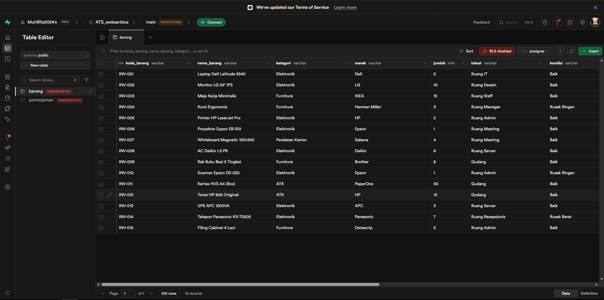

**SCREENSHOT: TABEL PEMINJAMAN:**
> 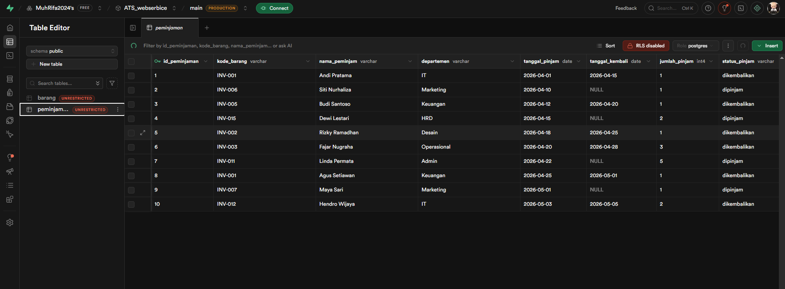

---

## 5. Screenshot Pengujian API Menggunakan Postman

**SCREENSHOT: POSTMAN - EDIT BARANG:**
>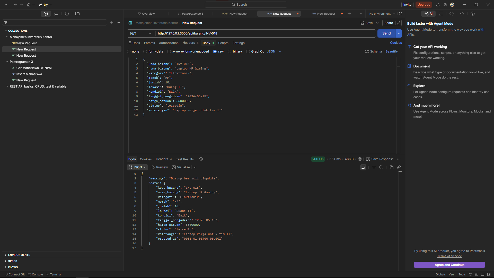

**SCREENSHOT: POSTMAN - DELETE BARANG:**
>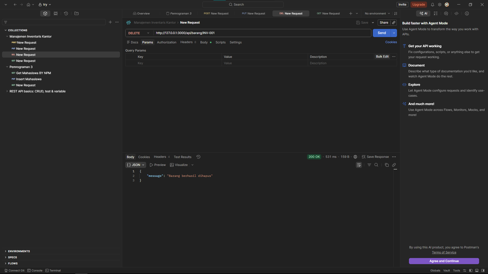

**SCREENSHOT: POSTMAN - GET ALL BARANG:**
> 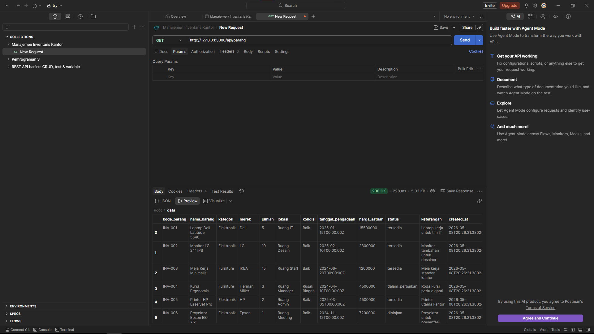

**SCREENSHOT: POSTMAN - GET BARANG BY ID:**
> 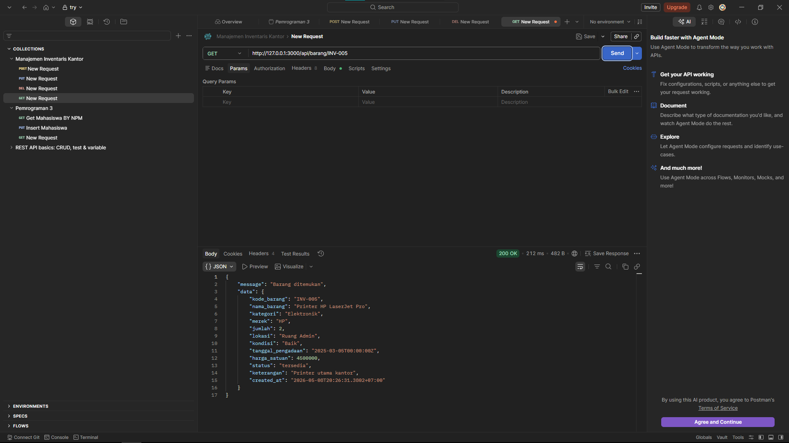

**SCREENSHOT: POSTMAN - POST TAMBAH BARANG:**
> 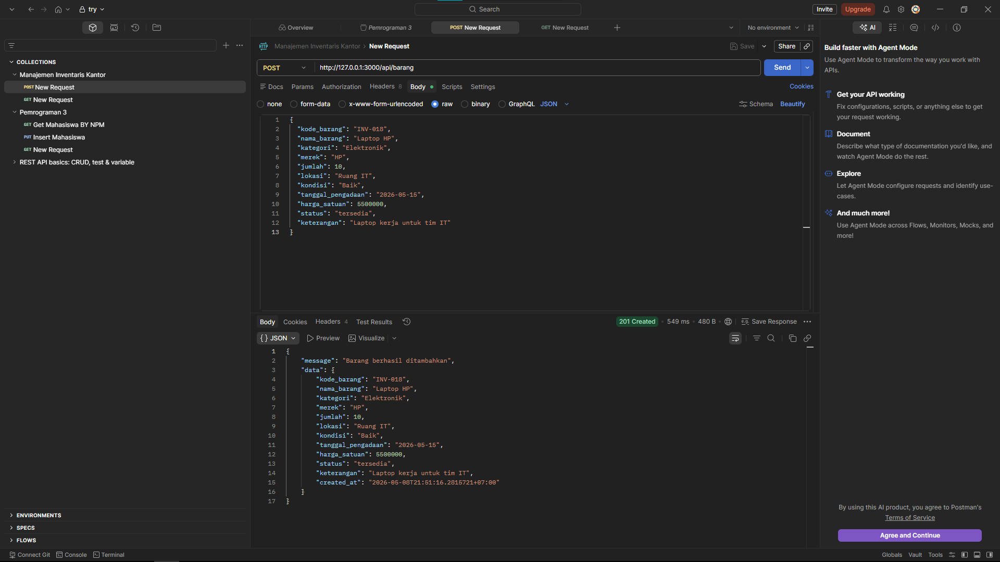

---

## 6. Screenshot Tampilan Frontend
[*(Antarmuka sistem manajemen inventaris yang dibangun menggunakan React).*]

**SCREENSHOT: HALAMAN DATA BARANG (GET ALL):**
> 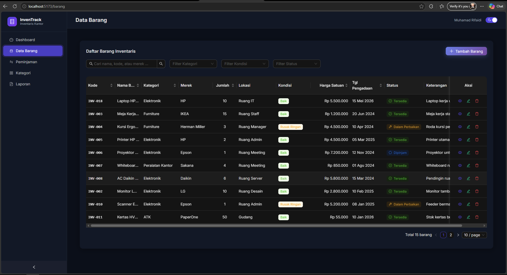

**SCREENSHOT: HALAMAN DETAIL BARANG (GET BY ID):**
> 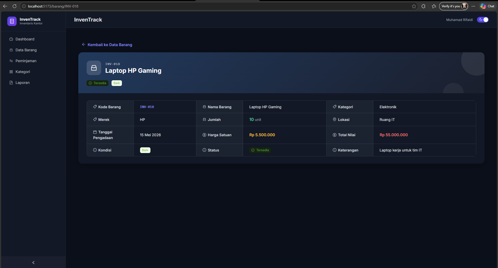

**SCREENSHOT: MODAL FORM TAMBAH/EDIT DATA:**
> 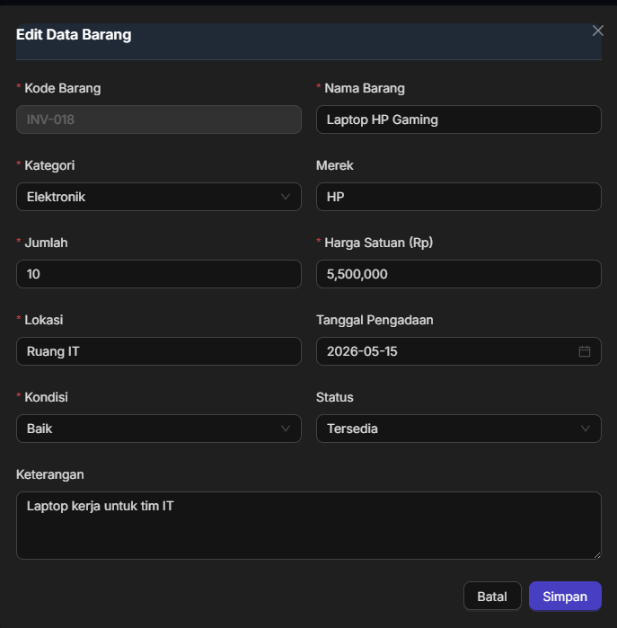

**SPACE SCREENSHOT: HALAMAN PEMINJAMAN:**
> 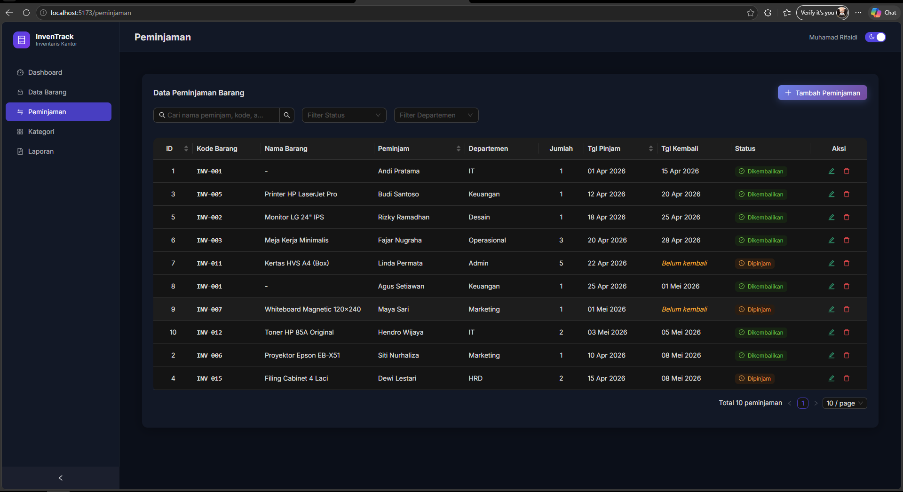
